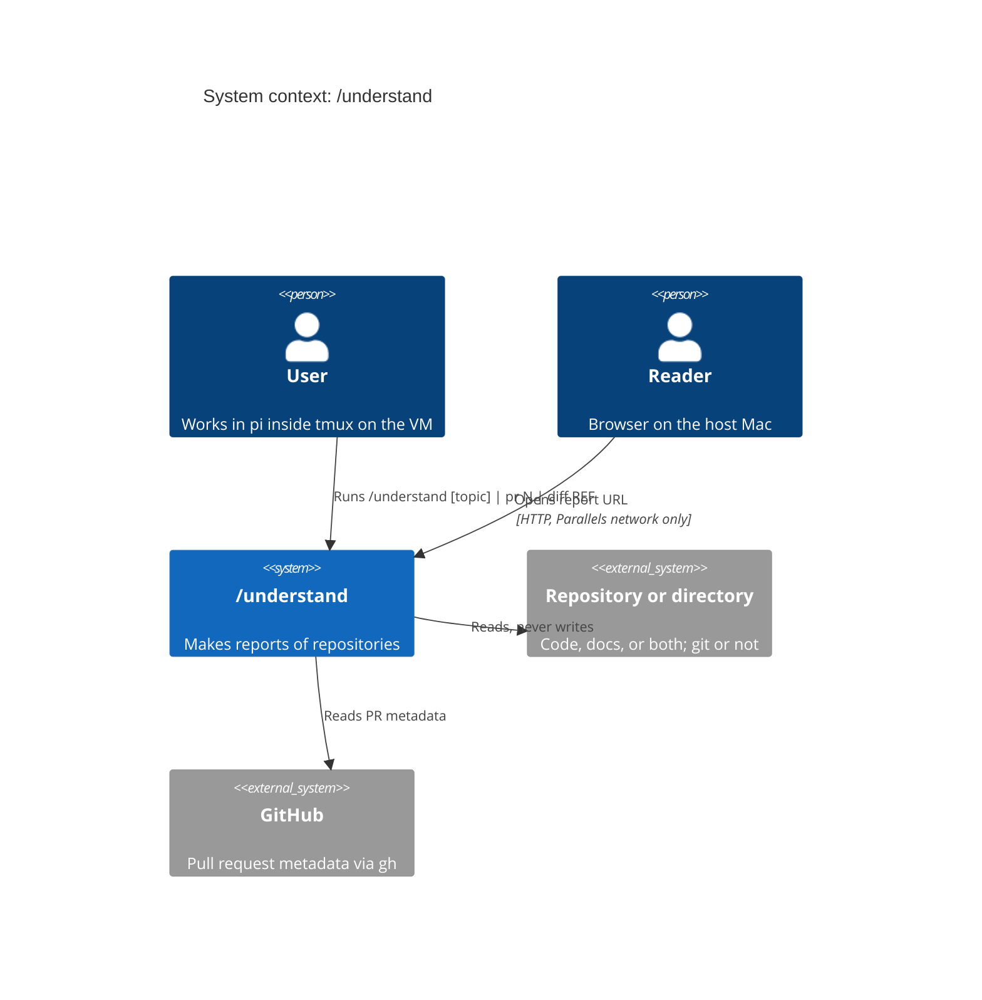
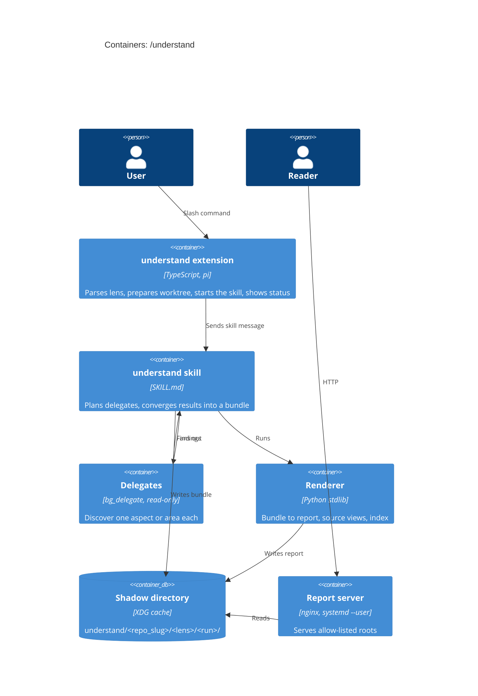

# /understand: architecture views

Decided boundaries from the [decision tree](decision-tree.md). Terms: [glossary](../../reference/understand/GLOSSARY.md).

## System context

```mermaid
C4Context
  title System context: /understand
  Person(user, "User", "Works in pi inside tmux on the VM")
  Person(reader, "Reader", "Browser on the host Mac")
  System(understand, "/understand", "Makes reports of repositories")
  System_Ext(repo, "Repository or directory", "Code, docs, or both; git or not")
  System_Ext(github, "GitHub", "Pull request metadata via gh")
  Rel(user, understand, "Runs /understand [topic] | pr N | diff REF")
  Rel(understand, repo, "Reads, never writes")
  Rel(understand, github, "Reads PR metadata")
  Rel(reader, understand, "Opens report URL", "HTTP, Parallels network only")
```

## Containers

```mermaid
C4Container
  title Containers: /understand
  Person(user, "User")
  Person(reader, "Reader")
  Container(ext, "understand extension", "TypeScript, pi", "Parses lens, prepares worktree, starts the skill, shows status")
  Container(skill, "understand skill", "SKILL.md", "Plans delegates, converges results into a bundle")
  Container(delegates, "Delegates", "bg_delegate, read-only", "Discover one aspect or area each")
  Container(renderer, "Renderer", "Python stdlib", "Bundle to report, source views, index")
  ContainerDb(shadow, "Shadow directory", "XDG cache", "understand/<repo_slug>/<lens>/<run>/")
  Container(server, "Report server", "nginx, systemd --user", "Serves allow-listed roots")
  Rel(user, ext, "Slash command")
  Rel(ext, skill, "Sends skill message")
  Rel(skill, delegates, "Fans out")
  Rel(delegates, skill, "Findings")
  Rel(skill, shadow, "Writes bundle")
  Rel(skill, renderer, "Runs")
  Rel(renderer, shadow, "Writes report")
  Rel(server, shadow, "Reads")
  Rel(reader, server, "HTTP")
```
